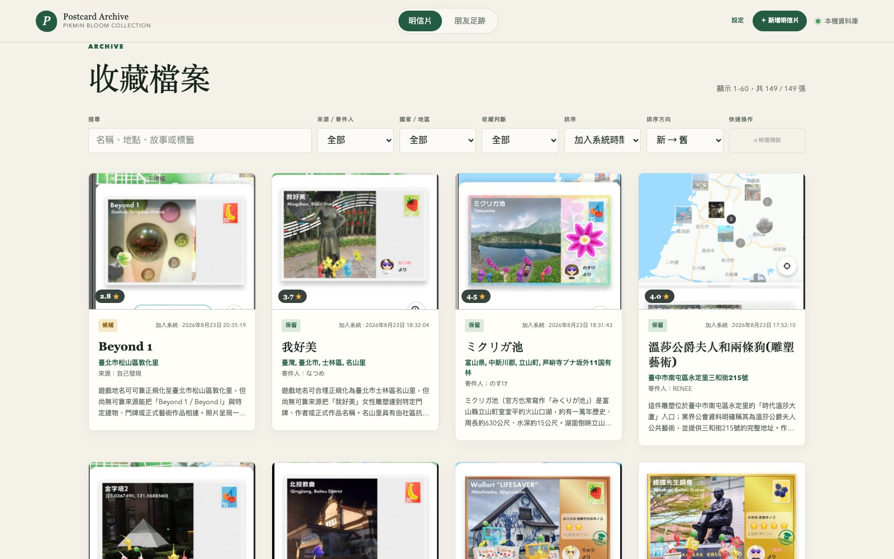
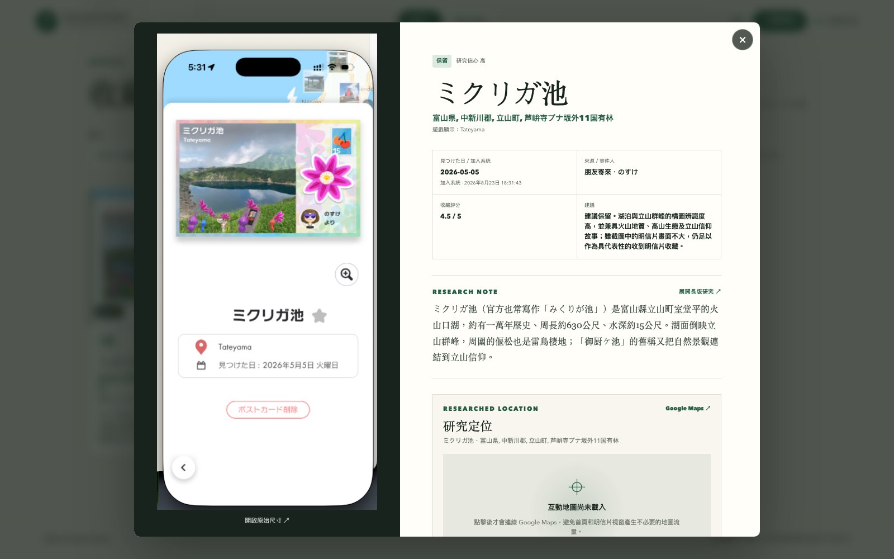
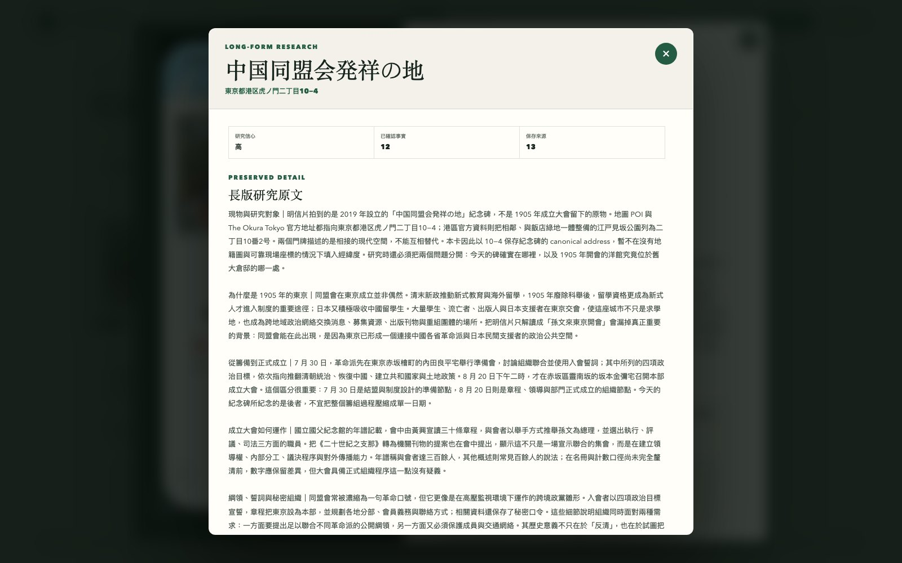
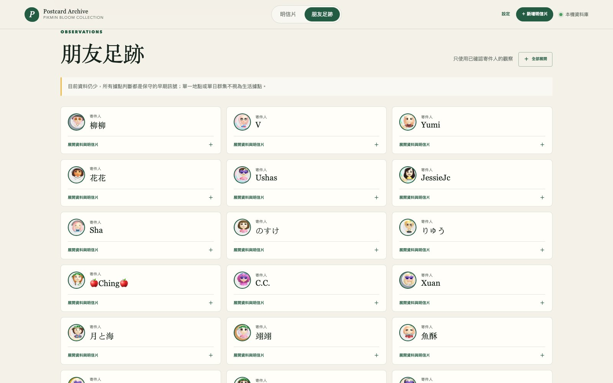
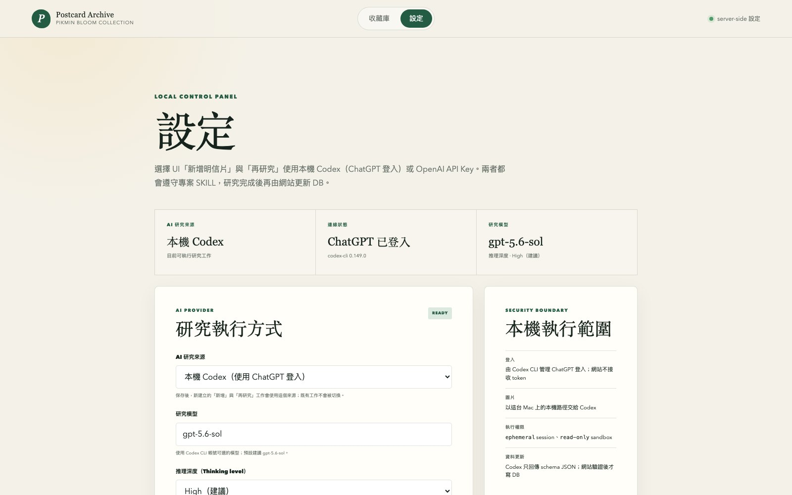

# Pikmin Postcard Archive

Pikmin Bloom 明信片的本機收藏、研究與朋友活動範圍證據庫。

程式碼與個人收藏分開保存：Git repository 只負責可重建的應用程式、schema、測試與空白資料範本；明信片圖片、JSON snapshots、SQLite、研究原文、source bundles、備份及 logs 都放在 repository 外的持久資料目錄。重新安裝程式不會清空收藏，移動或備份收藏也不需要搬動 `node_modules`、build 或 Git history。

新的 clone 第一次執行 `setup:local` 時會建立 **0 張明信片、0 位朋友、0 筆 import 與 0 筆 context** 的空白收藏；README 預覽圖只是產品文件，不會被 installer 匯入。需要搬移既有收藏時，請另外攜帶外部 `pikmin-postcards-data`，不要把它放回 Git。

## 介面預覽

### 收藏檔案

首頁集中提供全文搜尋、來源／寄件人與國家篩選、收藏判斷，以及加入系統時間、發現日期、評分或距離排序。每頁顯示 60 張，排序會套用到完整收藏後再分頁。



### 明信片研究檔案

單張檔案並列保存原始遊戲截圖、畫面 metadata、研究摘要、研究定位、故事參考圖片與管理操作；Google Map 只在使用者要求後載入。



### 長版研究

長版研究使用獨立、可捲動的 popup，保存完整研究本文、已確認事實、推論、未解問題、來源及 provenance，不會拉長旁邊的原始截圖。



### 朋友足跡

朋友頁優先顯示更多寄件人與 Mii avatar；證據、可能據點與每位玩家的明信片可按需展開。



### AI 研究設定

設定頁可切換本機 Codex 或 OpenAI API、模型與推理深度。模型只回傳 schema JSON，研究結果通過網站驗證後才寫入 DB。



以上畫面可從正在執行的本機服務重新產生：

```bash
npm run docs:screenshots
```

可用 `PIKMIN_SCREENSHOT_URL` 指向不同 port 或 LAN live server；腳本只讀取頁面並開啟既有視窗，不會新增、刪除或啟動研究。

## 五分鐘本機安裝

需要 macOS、Git、ImageMagick 與 Node.js 22.13 以上；專案的 `.node-version` 固定為 22.23.2。先安裝圖片裁切工具：

```bash
brew install imagemagick
```

再安裝專案：

```bash
git clone git@github.com-chiehlee:chiehlee/pikmin-postcards.git
cd pikmin-postcards
npx --yes -p node@22.23.2 -c 'npm run setup:local -- --port 3000'
```

`setup:local` 會一次完成：

1. 建立或重新連接旁邊的 `../pikmin-postcards-data`。
2. 將舊 checkout 內的個人資料安全遷移到該目錄；資料已在外部時只重接 symlink，不重複搬移。
3. 以 `npm ci` 建立 fresh dependencies。
4. 由 JSON snapshots 建立／同步 SQLite，執行 migrations。
5. 建立 production build，並保存 port 設定。

安裝後啟動整套本機服務：

```bash
npx --yes -p node@22.23.2 -c 'npm run local'
```

預設 port 是明確的 **3000**，服務監聽 `0.0.0.0:3000`：

- 本機：`http://localhost:3000`
- 區網／VPN：`http://<這台 Mac 的 VPN 或區網 IP>:3000`

要改 port，重新執行 setup 即可；例如改成 4317：

```bash
npx --yes -p node@22.23.2 -c 'npm run setup:local -- --port 4317'
```

查看實際使用的資料目錄、SQLite、logs、port 及 symlink 狀態：

```bash
npx --yes -p node@22.23.2 -c 'npm run local:status'
```

預設資料位置是與 repository 同層的 `pikmin-postcards-data`。可以在第一次 setup 時改用其他絕對位置：

```bash
npx --yes -p node@22.23.2 -c 'npm run setup:local -- --port 3000 --data-root /Volumes/Archive/pikmin-postcards-data'
```

資料目錄必須位於 Git repository 外。Installer 遇到「repo 與外部目錄同時已有資料」時會停止，不會猜測合併或覆寫。

安裝器會在 Git 忽略的 `.pikmin-local.json` 只記錄外部資料目錄位置，因此使用自訂 `--data-root` 後，往後仍可直接執行 `npm run local` 與 `npm run local:status`；收藏內容與 API key 都不會寫入這個 locator。

目前沒有登入機制。只應在可信任的區網或 VPN 上開放，並由主機防火牆限制可連線來源。

## 前後端與資料庫邊界

瀏覽器不 import `data/*.json`、不開啟 SQLite，也不接收資料庫 path、username 或 password。首頁啟動後只透過 `/api/archive` 取得帶 `api_version: 1` 的收藏 read model，新增、刪除、再研究與圖片也分別走 server API；後端才負責資料庫連線、migration、交易、檔案路徑與圖片 bytes。若後端暫時無法連線，前端會保留明確的 loading／error／retry 狀態，不以 build 時的舊快照冒充最新資料。

目前 production adapter 是 SQLite，server 可使用下列設定切換到另一個具有相同 migrations/schema 的 SQLite 檔案：

```bash
PIKMIN_DB_DRIVER=sqlite
PIKMIN_DATABASE_PATH=/absolute/private/path/pikmin-postcards.sqlite3
```

SQLite 沒有 username/password。若改用 PostgreSQL、MySQL 或 HTTP database service，帳密仍只能進 server secret/environment，不能用 `NEXT_PUBLIC_` 或設定成瀏覽器變數；但必須先為指定引擎實作 query/transaction adapter 與對應 migrations。只提供 username/password 並不足以安全連線，還需要 engine、host、port、database name、TLS/CA、credential rotation，以及圖片對應的 filesystem root 或 object-storage bucket。目前不會把「可填任意帳密」假裝成已支援任意資料庫。

## 網站內管理與 AI 再研究

首頁右上角的「新增明信片」可同時選擇多張本機圖片，也可貼上多行 HTTP(S)／Dropbox 圖片網址。兩種輸入可以放在同一批，沒有人工張數上限；每張圖片仍各自通過格式、100 MiB 上限與 SHA-256 檢查，並原樣保存到本機 intake。送出時有兩條路徑：

- 「新增明信片」：固定使用 GPT-5.6 支援的最低推理 `none`，只辨識畫面可見的名稱、`見つけた日`、遊戲地點、寄件人與來源介面證據，不使用 web search。卡片會先以「待研究」狀態進入收藏，之後可逐張按「再研究」。
- 「新增明信片並研究」：每張圖片直接依 [專案收錄 SKILL](.agents/skills/pikmin-postcard-intake/SKILL.md) 完成定位、故事、來源、收藏判斷、參考圖片與有限關聯研究。

大批次會全部先建立獨立工作，後端再以有界併發處理；預設同時執行 2 張，可用 `PIKMIN_AI_CONCURRENCY` 調整為 1–8。這不限制一批可以接收多少張，只避免本機 Codex 或 API 瞬間同時啟動過多工作。UI 會在獨立的「處理中的明信片」區塊逐張顯示原圖與進度，並只在右下角提供整批開始／完成／失敗摘要。每張 queued／in-progress 卡片可單獨中止：排隊工作會移出佇列，本機 Codex 子程序會終止，OpenAI 背景 response 已成立時會要求 API 取消；原圖、intake、prompt 與 job 紀錄仍保留，且不會寫入半套 canonical postcard。進入「更新資料庫」後不可中止，以保護原子寫入。Exact duplicate 不重跑 AI；單張錯誤或中止也不會取消同批其他工作。

完整研究可提議 0–3 張直接說明該地點或故事的參考圖片；後端驗證並下載到本機後，才會顯示在地圖下方。

每張明信片視窗另有兩個管理操作：

- 「再研究」：先在按鈕下方展開選填的補充欄，可加入親身經驗、現場關係、地址線索或網路上查不到的背景，再建立背景工作。補充原文會保存在 job、postcard provenance、canonical record 與本次 `research/raw/`，並完整放進研究 prompt；AI 可以用它引導查證與解讀，但沒有外部來源支持時只能明確標成使用者提供／親身觀察，不能冒充已證實事實。UI 顯示 queued／研究中／更新資料庫／完成、失敗或已中止，以及持續時間；重新載入頁面會從 SQLite 找回未完成工作並繼續 polling。
- 「刪除」：需再次確認，只 soft delete 當前 postcard。正常列表會隱藏它，但原圖、研究檔、SQLite row、provenance、關聯及其他疑似重複明信片都保留，ID 不回收。

首頁右上角的「設定」會開啟 `/settings`。在這台 Mac 的瀏覽器使用 `http://localhost:3000/settings`，可以：

- 設定、替換或移除 server-side OpenAI API key。
- 選擇研究 model；新工作會在建立時保存當下的 model ID。
- 保存前測試新 key，或測試目前已保存的連線。
- 查看「已設定／未設定」、來源與末四碼遮罩；網站永遠不會把完整 key 讀回瀏覽器。

設定頁把 key 原子寫入 Git 已忽略的 `.env.local`，權限設為 `0600`，並同步目前 server process，因此由設定頁保存後不必重啟。這符合 OpenAI 的 [API key 安全建議](https://help.openai.com/en/articles/5112595-best-practices-for-api-key-safety)：key 留在 server，不部署到瀏覽器，也不提交到 repository。`.env.local` 很小且不屬於收藏資料；重新 clone 時可在 localhost 設定頁重新設定，或另行以密碼管理器備份。

目前 LAN／VPN 網址使用 HTTP，因此從其他裝置開啟設定頁時，key 欄位與移除操作會鎖定，避免祕密在網路上明文傳輸；仍可調整 model，並由 server 使用已保存的 key 測試連線。要設定 key，請回到主機上的 localhost。若日後為站點加入 HTTPS 與登入，再重新評估遠端祕密管理。

也可以保留手動 fallback。先從範本建立不進 Git 的本機環境檔：

```bash
cp .env.example .env.local
```

再把 `OPENAI_API_KEY` 填入 `.env.local` 並重啟 server。不要使用 `NEXT_PUBLIC_` 前綴，也不要把真正的 key 貼進程式、snapshot、SQLite 或 commit。這個 repository 目前刻意不含任何 API key；之後可一起在 localhost 設定頁完成實際連線。

平常不需要手動執行 production build；`setup:local` 已包含建置。若程式碼更新，重新跑同一個 setup 指令即可。建置與完整 UI 測試會改寫 production output，因此維護前先停止正在使用的 `npm run local`，完成後再啟動，避免操作期間出現短暫 500。

只在開發維護時手動執行：

```bash
npm run build
npm run local
```

## 測試與驗證

```bash
npm run test:unit
npm run test:regression
npm run test:functional
npm run test:ui
npm run verify
```

- `test:unit`：純函式與領域規則，包含 line 95%、branch 80%、function 95% 的 coverage gate。
- `test:regression`：canonical 圖片、資料筆數、來源分類、雙向關聯、JSON ↔ SQLite round-trip 與既有 bug cases。
- `test:functional`：先 production build，再從外部邊界測試圖片 intake、關聯候選 CLI、HTTP 網站與 canonical 圖片。
- `test:ui`：以 Playwright Chromium 在桌面與手機 viewport 操作 production UI；涵蓋 modal 捲動、鍵盤／焦點、背景關閉、Google Map 延遲載入、新增、soft delete、再研究進度、工作中止，以及設定頁的 key 遮罩、localhost／LAN 權限、連線測試與確認移除。失敗時保留 screenshot、trace 與 video。
- `test:quick`：開發中快速執行 unit + regression。
- `test:watch`：修改程式時持續重跑 unit + regression，提供即時回饋。
- 第一次在新電腦執行 UI test 前先跑 `npx playwright install chromium`。`npm test` 等同完整的 `test:all`；`npm run verify` 再加上 lint、TypeScript、DB integrity/query plans 與資料統計，是 commit 前固定入口。

測試檔必須以 `.unit.test.mjs`、`.regression.test.mjs` 或 `.functional.test.mjs` 結尾。Regression suite 會檢查分類，避免新測試因為命名錯誤而沒有被固定入口執行。新增或改變行為時，同一個變更必須新增或修改至少一個能觀察該行為的測試；修 bug 時，能重現問題的 regression test 應先於修正通過。

檢查單張圖片或 metadata 是否已存在：

```bash
npm run check:duplicate -- \
  --image /path/to/postcard.png \
  --poi '金字塔2' \
  --found-date 2026-05-17 \
  --origin self_found
```

去重順序：

1. 圖片 SHA-256 完全相同：確定重複。
2. `POI + found_date + sender／來源狀態` 完全相同：可能重複，交由人工確認。
3. 已確認寄件人不同：不自動合併。

## 來源與寄件人判讀

`sender: null` 不等於「未知寄件人」。每張明信片另有 `acquisition`，把來源和寄件人狀態分開：

- 畫面可見 `フレンドに送る`：`self_found`，代表自己發現；寄件人欄位不適用。
- 畫面有已確認的 `○○ より`：`received`，並保存實際寄件人。
- 收到的明信片沒有可確認名稱，例如好友已移除後畫面留白：`received`，但 `sender_status` 為 `unknown`。
- UI 證據不足時才使用 `acquisition.type: unknown`，不以 `sender: null` 自動猜測。

未來的 session manifest 應盡量保存 `send_to_friend_button_visible`、`sender_panel_visible` 與 `sender_area_blank`。匯入器會依這些畫面證據建立來源分類；沒有證據時維持未知，不套用整批猜測。

## 研究筆記保存方式

列表與明信片視窗先顯示適合快速閱讀的 `research.summary`；按下視窗內的 `RESEARCH NOTE` 會開啟獨立、可捲動的長版研究視窗，再顯示保存下來的 `research.detail`、已確認事實、推論、未解問題與來源路徑。關閉長版研究後會回到原本的明信片視窗與觸發按鈕。

每張明信片的長版狀態會明確保存為：

- `raw_preserved`：有原始研究段落可回溯。
- `structured_preserved`：有當時保存下來的結構化研究內容。
- `not_recovered`：來源記錄顯示曾研究過，但匯出時原研究回合已不在可用 transcript；只標示缺漏，不用新寫內容冒充原文。

新 bundle 的 manifest 可在每張 postcard 加上 `research_detail`（或相容欄位 `research_detail_body`）；匯入器會和 condensed `research_summary` 分開保存。

`research.images` 保存故事參考圖片的本機 path、bytes、media type、SHA-256、來源頁、直接圖片來源的安全 locator／hash、繁中 caption／alt 與 credit。網站不 hotlink 外部圖片；單張最多 10 MiB、每次研究最多採用 3 張，沒有足夠關聯的圖片時保持空陣列。再研究若沒有任何新圖片成功落地，會保留既有圖集與所有舊檔。

## 研究定位、座標與距離

有保存研究內容的明信片會顯示「研究定位」。外部 Google Maps 搜尋連結與內嵌地圖都不需要本機 API key；內嵌使用 Google Maps 的分享式地圖網址，並且只在使用者按下「載入 Google Map」後建立單一 iframe，不會在首頁或開啟明信片視窗時預先載入。若 Google 日後變更分享式嵌入行為，右上角的外部 Google Maps 連結仍可作為 fallback。

Google 地圖與收藏座標是兩條獨立資料路徑：地圖只收到正規化後的 `address_local`／POI 查詢字串，由 Google 自行解析 marker；距離排序只讀取 DB 已保存的緯度、經度，不拿 Google iframe 的結果回寫 DB。這避免把第三方永久座標混成 Google Maps 內容，也讓距離計算不必載入任何地圖。

完整研究先保存來源能支持的最深地址，再由 server-side geocoder 解析座標。預設使用 OpenStreetMap Nominatim，並保存 provider、實際 query、matched label/type、地址精度、座標解析精度、信心、解析時間、OSM object URL 與 `© OpenStreetMap contributors` attribution。公共 Nominatim 的批次工具遵守單執行緒、每秒不超過一次、具識別 User-Agent、cache 與可續跑報告；詳見 [Nominatim Usage Policy](https://operations.osmfoundation.org/policies/nominatim/) 與 [OpenStreetMap copyright/ODbL](https://www.openstreetmap.org/copyright)。Google Geocoding API 的 latitude/longitude 依現行條款只能暫存 30 天，因此不作為永久 archive 的預設資料來源；詳見 [Google Maps Service Specific Terms](https://cloud.google.com/maps-platform/terms/maps-service-terms)。

距離排序使用目前裝置 geolocation，或使用者自行輸入的緯度／經度，套用 Haversine 球面距離比較每張卡保存的座標。若門牌無法由 geocoder 精確解析，系統會按 road → locality → district → city → region → country 逐級退回；研究地址本身仍保留原證據精度，另以 `location.geocode.precision` 說明距離座標實際精度，不把路段或城市中心冒充門牌。沒有座標的卡固定排在有座標資料之後。

## 朋友足跡

朋友卡預設只顯示 Mii avatar 與寄件人／遊戲 ID，讓同一個螢幕容納更多玩家；若有保守推測的據點，會在 ID 同一排顯示「可能據點」。信心、觀察數、避免寄送、研究說明與明信片收進「展開資料與明信片」。每位朋友展開後最多直接顯示 5 張明信片；超過時顯示「更多」與剩餘張數。點擊後會開啟獨立、可捲動的完整清單 popup，可用鍵盤循環焦點、Esc 或背景點擊關閉，也能從清單繼續開啟單張明信片。

新增或再研究完成時，同一次 AI 畫面判讀會提供已確認寄件人 Mii 的正規化裁切框；backend 驗證信心與邊界後，自動以原圖像素產生 WebP avatar，並將來源 postcard、來源 checksum、crop box 與生成狀態寫回朋友資料和 SQLite。後續同名玩家出現更高實際 crop 像素的可靠截圖時會自動替換；ImageMagick 暫時不可用或畫面無法可靠定位時不會回滾 postcard，而會保存失敗／等待證據狀態，於下一次有效證據變動自動重試。這是 backend 的正常流程，不需要維護者執行針對特定收藏的補圖腳本。

據點分析不是按日排程。新增已確認寄件人的明信片，或再研究真的改變該玩家的日期／研究定位證據時，系統只重算受影響的玩家；批次匯入則每位玩家最多重算一次。自動早期訊號需要同一區域至少 3 個不同日期、跨 14 天並占全部有效日期至少 60%；同日多張只算一次，短期集中另視為可能旅遊群集。Soft delete 仍保留既有朋友證據，不會因清理疑似重複明信片而扭曲玩家足跡。

## 地名的原文與譯名

每張 postcard 的 `location.raw` 永遠保存遊戲畫面原字串，UI 以「遊戲顯示：」呈現，不會被研究結果覆寫。粗體研究地名使用分開的欄位：

- `endonym`：研究確認的當地原名；日本用日文、臺灣／香港／澳門用繁體中文、韓國用韓文、美國用英文，其他地區依當地語言。
- `zh_tw`：當 `endonym` 不是中文或日文時保存台灣慣用的繁體中文譯名；UI 組成 `原名（台灣繁中譯名）`。
- `country_endonym`：當地語言的國家名。臺灣、日本以外的主標會在原名及繁中譯名最後附上國家。
- `address_local`：不分國家，先研究 POI／現物的實際完整地址；保存可靠來源能支持的最深層級並提供地圖查詢。臺灣也直接用它組成畫面主標。
- `precision`：目前可靠精度，例如 `district`、`locality`、`road` 或 `full_address`。
- `language`：原名語言標籤；`name_status` 與 `name_confidence` 分別保存研究狀態及信心。
- `display`：由上述欄位組成的快取；所有地區都優先顯示最深的 `address_local`，必要時附 `zh_tw`。卡片以兩行省略和完整 title 控制長度，研究視窗則折行顯示完整地址。

地址研究一律先嘗試 `full_address`；無法證實才按 `road → locality → district → city → region → country → unknown` 逐級退回，`precision` 要反映真正的證據解析度。臺灣與日本不附國名並按當地習慣連寫；其他國家按當地地址順序使用半形逗號並把當地國名放在最後。非中日文另保存相同精度、按臺灣繁中閱讀順序且含國名的 `zh_tw`。所有國家只要有可靠完整地址，主標就顯示完整地址，不再因國家而刻意降低解析度。

地址正規化與永久座標的一次性／repair 工具是：

```bash
# dry-run：可續跑 cache 與報告都放在 Git 忽略的 var/
npm run backfill:location-geocodes

# dry-run、snapshot → SQLite 驗證都通過後才正式寫入；會先建立完整 archive backup
npm run backfill:location-geocodes -- --commit
```

## 資料結構

- `../pikmin-postcards-data/snapshots/`：canonical JSON snapshots；repo 內的 `data` 是安裝器建立的 symlink。
- `../pikmin-postcards-data/images/`：不可變更的原圖、Mii crops 與研究圖片；repo 內的 `public/images` 是 symlink。
- `../pikmin-postcards-data/research/raw/`：長版研究；repo 內的 `research/raw` 是 symlink。
- `../pikmin-postcards-data/imports/source-bundles/`：原始 ZIP bundles；repo 內相同位置是 symlink。
- `../pikmin-postcards-data/runtime/pikmin-postcards.sqlite3`：SQLite operational database；repo 內的 `var` 是 symlink。
- `../pikmin-postcards-data/backups/archive-*/`：可獨立驗證的 archive backups；每份都同時包含 SQLite、snapshots、所有 DB 引用圖片、intake 圖片、研究原文與來源 bundles。
- `../pikmin-postcards-data/runtime/image-inbox/`：尚未 canonicalize 的圖片 intake，以 SHA-256 命名。
- `../pikmin-postcards-data/logs/`：Wrangler 與本機維護 logs。
- `../pikmin-postcards-data/config/runtime.json`：安裝路徑、host 與 port；權限為 `0600`。
- `.pikmin-local.json`：Git 忽略的外部資料目錄 locator；只保存路徑，不含收藏或祕密。
- `templates/fresh-data/`：全新、空白收藏使用的最小 JSON snapshots；不含個人明信片。
- `db/migrations/`：可版控、依序執行的資料庫 schema migrations。
- `ai_jobs`（SQLite）：保存 UI 新增／再研究工作的收錄模式、batch ID、輸入辨識標籤、使用者再研究補充、prompt、SKILL checksum、OpenAI response ID、狀態、時間、結果或錯誤；不保存 API key。使用者補充也會寫入 postcard provenance 與 canonical record，避免工作完成後失去第一手來源身分。
- `.env.local`：本機 server 設定（不進 Git）；設定頁以 `0600` 保存 OpenAI API key 與研究 model。
- `scripts/merge-session-bundle.mjs`：驗證 ZIP 內所有 checksum，合併新 bundle 並保留 provenance。
- `scripts/check-duplicate.mjs`：兩階段去重檢查。

圖片不存進 SQLite；資料庫只保存圖片的本機路徑、網站路徑、checksum、欄位、關聯、研究來源與 provenance。既有 `assets.local_path` 仍使用穩定的 `public/images/...` 邏輯路徑，但該路徑會透過 symlink 指向外部 archive；`image_intake.local_path` 同理使用 `var/image-inbox/...`。這讓 schema 不必綁定某台 Mac 的絕對路徑，同時避免 DB 與 Git repository 隨圖片數量快速膨脹。

## 匯入單張圖片

聊天附件先使用附件在本機的實際路徑；一般本機圖片與 Dropbox／HTTP(S) 連結使用同一個入口：

```bash
npm run image:ingest -- --source '/local/path/postcard.png'
npm run image:ingest -- --source 'https://www.dropbox.com/scl/fi/.../postcard.png?rlkey=...&dl=0'
```

匯入器會依序下載或讀取圖片、檢查格式與 100 MiB 上限、計算 SHA-256、以 content-addressed 名稱落地，再寫入 DB。新圖片會標記為 `pending`；若 checksum 已屬於 canonical asset，則直接標記為 `canonicalized` 並指向既有的 `public/images/...`。相同圖片或相同來源重送不會建立重複檔案。

遠端 URL 的 query string 不會原文存進資料庫；DB 只保留移除 query 後的位置與完整來源字串的 SHA-256，避免把 Dropbox token 類資訊寫入紀錄。圖片成為正式明信片後，bundle merge／`db:sync` 會把相同 checksum 的 intake 自動連回 canonical asset。

### SQLite 與網站 snapshot

網站讀取外部 archive 經 symlink 提供的 `data/*.json`，瀏覽器不會直接碰資料庫。SQLite 是本機查詢、去重與匯入流程使用的結構化資料層；合併新 bundle 時會同步更新資料庫與 JSON snapshot。Git 只保留空白 snapshot template 與 schema，不保存個人收藏。

從外部 archive 的 JSON 重建／同步本機資料庫（若已有 DB，會先建立一份 DB＋圖片完整備份）：

```bash
npm run db:sync
```

預設資料庫的每次自動備份不再只複製 `.sqlite3`，而會建立完整 archive snapshot。也可手動建立並驗證：

```bash
npm run backup:create
npm run backup:verify -- --backup /path/to/pikmin-postcards-data/backups/archive-YYYY-MM-DD...
```

每個 backup 目錄本身就是一套可搬移的資料根目錄：`runtime/pikmin-postcards.sqlite3`、`snapshots/`、`images/`、`runtime/image-inbox/`、`research/raw/`、`imports/source-bundles/` 與 `manifest.json`。Manifest 保存每個檔案的 bytes／SHA-256、migration 版本及 DB asset/intake 引用數；建立完成前會逐一確認 DB 指向的圖片都存在，驗證時會重新計算 checksum。

同一磁碟上的不可變圖片、研究檔與來源 bundles 使用 hard links，讓每份 backup 都有自己的完整目錄項目，卻不為相同 bytes 重複占用磁碟 blocks。刪除 live 檔不會刪掉 backup inode；將整個 backup 目錄複製到另一顆磁碟時，則會自然寫成一般獨立檔案。SQLite 與會變動的 JSON snapshots 永遠實際複製，不使用 hard link。

要還原到另一個乾淨位置，先完整複製某一個 `archive-*` 目錄，再把副本當成新的 `--data-root` 執行 `setup:local`；不要只拿其中的 `.sqlite3`，否則會失去圖片綁定與 manifest 驗證能力。

查看統計並檢查資料庫完整性、foreign keys、JSON 無損 round-trip 與主要 query plans：

```bash
npm run db:stats
npm run db:verify
```

需要把資料庫內容重新輸出為網站 snapshot 時：

```bash
npm run db:export
```

覆寫 `data/` 前也會先建立上述完整 archive backup。現階段適合單機／單一寫入者；若未來變成多台主機或多人同時寫入，再為 PostgreSQL 建立正式 server adapter 與 migration 會比較合適。

## 合併新的 session bundle

先執行 dry run：

```bash
npm run merge:bundle -- --bundle /path/to/bundle.zip --id unique-session-id
```

確認報告後才寫入：

```bash
npm run merge:bundle -- --bundle /path/to/bundle.zip --id unique-session-id --commit
```

合併先以截圖 hash 去重，再比對 POI、`found_date` 與寄件人。Byte-identical 重貼會收斂為一個 canonical asset，但每次出現仍保存在來源 ZIP 與 provenance；不同截圖即使 metadata 相同也不會被刪除。
